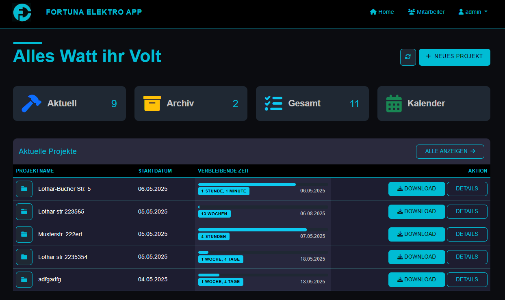
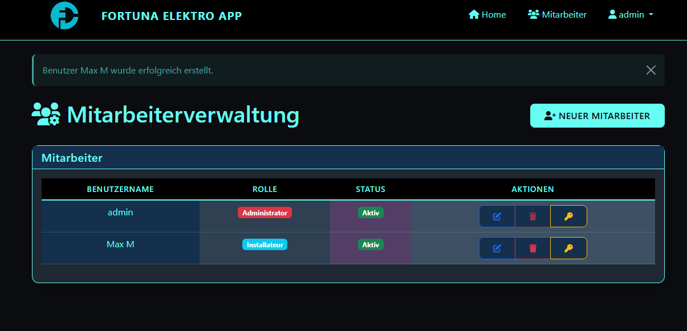
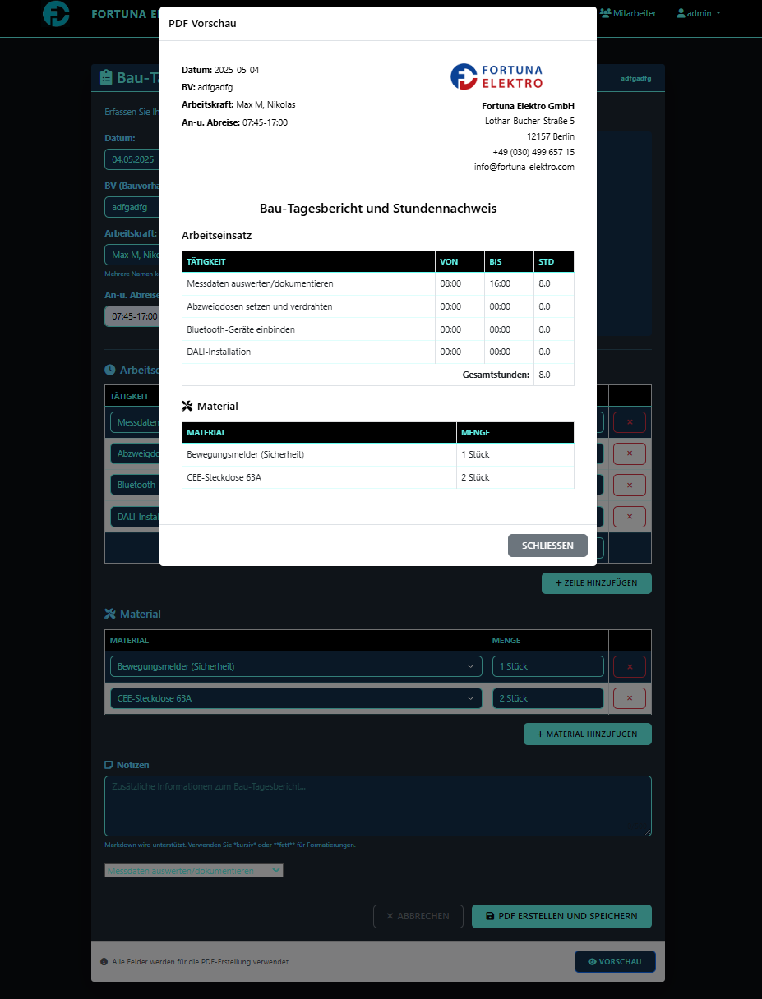
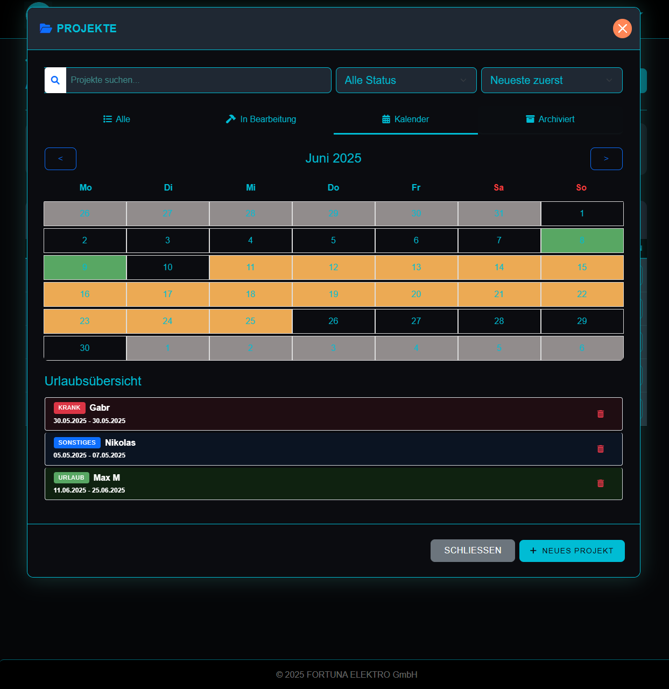
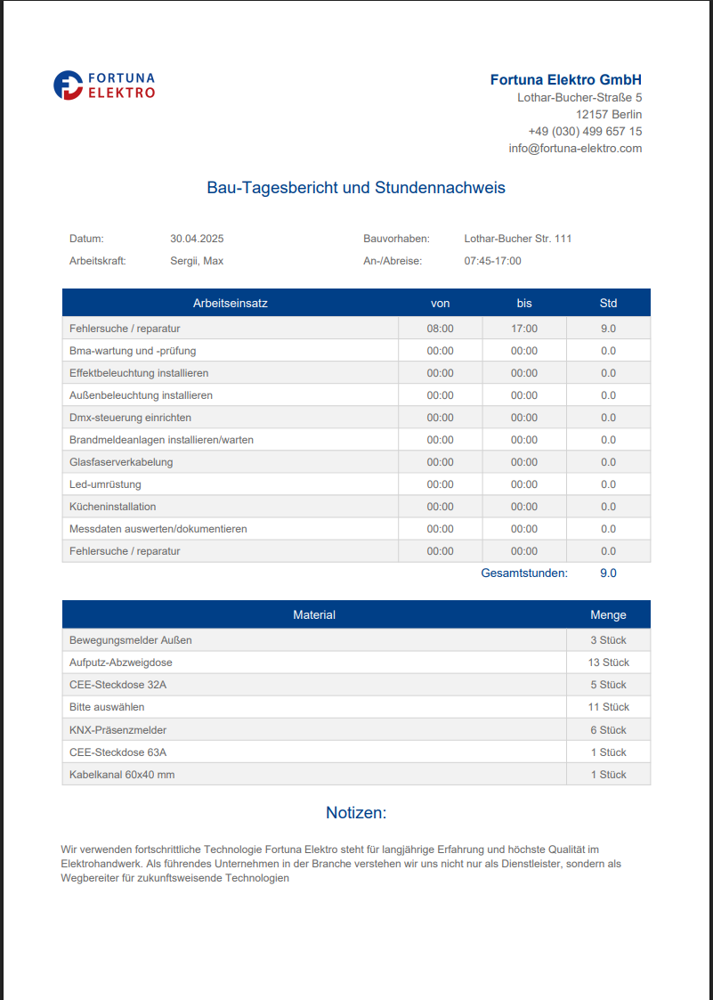
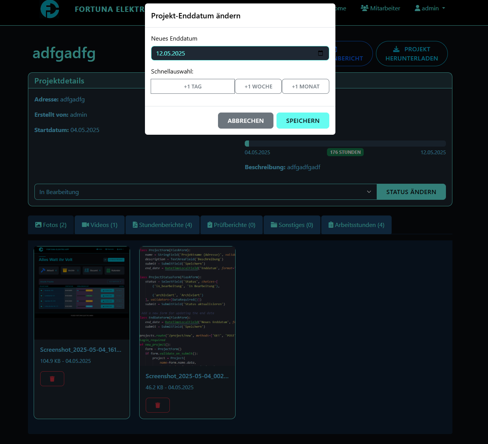
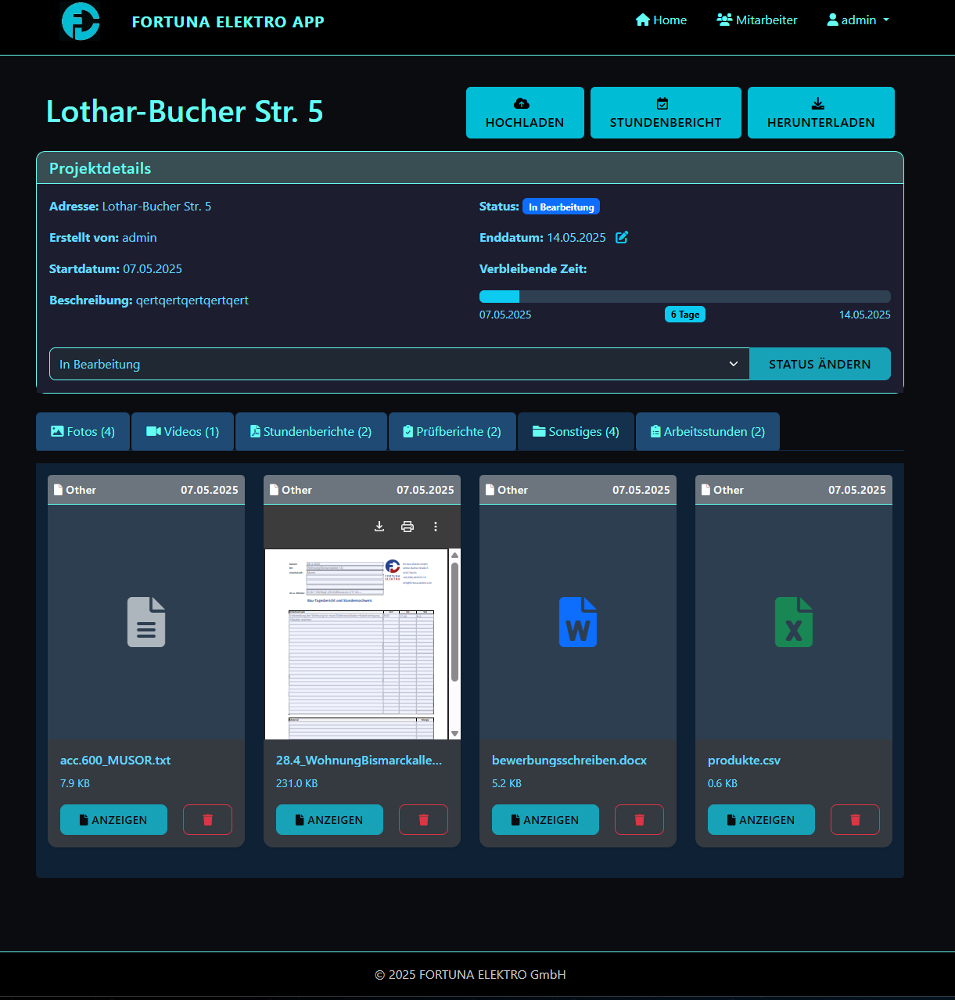
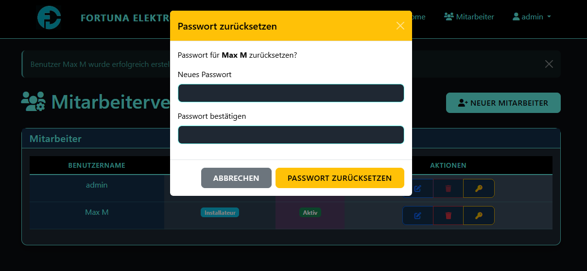

 
# FORTUNA ELEKTRO Web App


<div align="center">




**A comprehensive project management solution for electrical installation professionals**

[](https://www.python.org/)
[](https://flask.palletsprojects.com/)
[](https://developer.mozilla.org/en-US/docs/Web/JavaScript)
[](https://getbootstrap.com/)
[](https://www.sqlalchemy.org/)
[](LICENSE)

</div>

## 📋 Overview

The FORTUNA ELEKTRO Web App is an efficient and user-friendly project management solution specifically designed for electrical installation professionals. It simplifies daily documentation processes, enhances team coordination, and provides comprehensive reporting capabilities. This application helps you manage projects, track work hours, document installations with photos and videos, and generate professional PDF reports.

## ✨ Key Features

### 📁 Project Management
- **Create & Configure Projects**: Set start dates, addresses, and completion deadlines
- **Dynamic Project Status**: Track projects as "In Progress" or "Archived"
- **File Attachments**: Upload photos, videos, and other documents to projects
- **Complete Project Export**: Download all project data and related files

### 👥 User Management
- **Administrator Controls**: Create new user accounts with credentials
- **Permission Levels**: Assign roles (Administrator or Installer)
- **Account Management**: Activate/deactivate users, reset passwords, delete accounts

### 📊 Organization Tools
- **Advanced Search & Sort**: Quickly find projects based on various criteria
- **Calendar Integration**: Schedule and manage:
  - Vacation time
  - Sick leave
  - Appointments/meetings
- **Time Tracking**: Keep detailed records of work hours

### 📄 Documentation & Reporting
- **Custom PDF Generator**: Create professional time reports with:
  - Company logo and branding
  - Customizable table structure and content
  - Professionally designed color schemes
- **Activity Documentation**: Select from predefined tasks and materials
- **Live Preview**: Review reports before PDF generation

### 💾 Data Management
- **Secure Database**: All data is securely stored and backed up
- **Complete Data Integrity**: Comprehensive tracking of all project information

## 🛠️ Technology Stack

- **Backend**: Python with Flask framework
- **Frontend**: JavaScript, HTML5, CSS3 with Bootstrap
- **Database**: SQLAlchemy ORM
- **Migration**: Alembic
- **Authentication**: Flask-Login
- **Forms**: Flask-WTF, WTForms
- **Image Processing**: Pillow
- **PDF Generation**: ReportLab
- **Date Handling**: Python-dateutil

## 📋 Dependencies

```
alembic==1.15.2
blinker==1.9.0
chardet==5.2.0
click==8.1.8
colorama==0.4.6
Flask==2.2.5
Flask-Login==0.6.3
Flask-Migrate==4.1.0
Flask-SQLAlchemy==3.1.1
Flask-WTF==1.2.2
greenlet==3.2.1
itsdangerous==2.2.0
Jinja2==3.1.6
Mako==1.3.10
MarkupSafe==3.0.2
pillow==11.2.1
reportlab==4.4.0
SQLAlchemy==2.0.40
typing_extensions==4.13.2
Werkzeug==2.2.3
WTForms==3.2.1
python-dateutil==2.9.0.post0
six==1.17.0
```

## 🚀 Installation

1. Clone the repository:
   ```bash
   git clone https://github.com/Lightmaker777/FORTUNA_ELECTRO.git
   cd fortuna-elektro-webapp
   ```

2. Create and activate a virtual environment:
   ```bash
   python -m venv venv
   source venv/bin/activate  # On Windows: venv\Scripts\activate
   ```

3. Install dependencies:
   ```bash
   pip install -r requirements.txt
   ```

4. Set up the database:
   ```bash
   flask db upgrade
   ```

5. Start the development server:
   ```bash
   flask run
   ```

## 💻 Usage

### Initial Setup

1. Create an administrator account on first run
2. Log in and set up user accounts for your team
3. Configure company details for PDF generation

### Daily Workflow

1. Create new projects with client details
2. Assign installers to projects
3. Track work hours and materials used
4. Upload documentation photos and videos
5. Generate professional PDF reports
6. Manage team availability through the calendar

## 📱 Screenshots

<div align="center">
   <p><i>Dashboard Overview</i></p>
  
  
  <p><i>Project Management Interface</i></p>
  
  
  <p><i>PDF Report Generator</i></p>
  
  
   <p><i>Calendar Overview</i></p>
  
  
  <p><i>PDF File</i></p>
  
  
  <p><i>Projectdetails Page</i></p>
  

  <p><i>Projectdetails Page Others  </i></p>
  
  
   <p><i>User Password Changing</i></p>
  
  
</div>

## 🔒 Security

The FORTUNA ELEKTRO Web App implements several security measures:
- Secure user authentication with password hashing
- Role-based access control


## 🤝 Contributing

Contributions are welcome! Please feel free to submit a Pull Request.

1. Fork the repository
2. Create your feature branch (`git checkout -b feature/amazing-feature`)
3. Commit your changes (`git commit -m 'Add some amazing feature'`)
4. Push to the branch (`git push origin feature/amazing-feature`)
5. Open a Pull Request

## 📄 License

This project is licensed under the MIT License - see the LICENSE file for details.

## 📞 Contact

For questions or support, please contact:
- Email: info@fortuna-elektro.com
- Website: [www.fortuna-elektro.com](https://fortuna-elektro.com/)

---

<div align="center">

 
  <p>© 2025 FORTUNA ELEKTRO GmbH. All rights reserved.</p>
</div>